# Rust SMTP/IMAP Server Documentation

## 1. Introduction

### 1.1 Purpose of the Project
This project implements **robust, secure, and efficient SMTP and IMAP servers** in Rust. It supports:
- **Plain text and TLS-encrypted connections** (with `stunnel` recommended for production).
- **MongoDB and local file storage** for emails (configurable via `USE_MONGODB`).
- **Async I/O** (Tokio-based) for high concurrency.
- **SMTP/IMAP authentication** (AUTH LOGIN and AUTH PLAIN).
- **DKIM signature handling** (optional).

### 1.2 Key Features
- **Async SMTP/IMAP servers** (Tokio runtime) for high performance.
- **MongoDB integration** (Atlas or local Docker Compose).
- **TLS support** (Rustls) with configurable certificates.
- **Authentication** (AUTH LOGIN/PLAIN) with environment variables.
- **Email storage** (MongoDB or local filesystem).
- **DKIM signature handling** (optional).
- **Environment variable configuration** (`.env.example` provided).
- **Hermes gateway** (`POST /api/hermes/chat`, `POST /api/hermes/runs`, `GET /api/hermes/runs/{run_id}`, `GET /api/hermes/runs/{run_id}/events`) for secure server-to-server AI calls, including optional explicit `sessionId`/`sessionKey` overrides for cross-service thread continuity and SSE passthrough.

### 1.3 Technology Stack
- **Rust** (2021 edition)
- **Tokio** (async runtime)
- **Rustls** (TLS)
- **MongoDB** (database)
- **Serde** (serialization)
- **Mailparse** (email parsing)
- **Dotenv** (environment variables)

---

## 2. Recent Updates (2026-07-23)
- **MongoDB integration**: Added support for MongoDB (Atlas or local Docker Compose). Toggle via `USE_MONGODB=true/false`.
- **Async SMTP/IMAP servers**: Refactored to use Tokio for async I/O (improves concurrency).
- **Dependency updates**: Addressed GitHub vulnerabilities (updated `mongodb`, `rustls`, `reqwest`, `warp`).
- **DKIM support**: Added optional DKIM signature handling.
- **Docker Compose**: Added `mongodb` service and health checks.
- **Environment variables**: Updated `.env.example` with MongoDB and DKIM settings.

---

## 3. System Architecture

### 3.1 High-Level Overview
The project consists of **two async servers** (Tokio-based):
- **SMTP Server**: Listens on ports `8025` (plain) and `8465` (TLS).
- **IMAP Server**: Listens on port `143` (plain) and `993` (TLS).

### 3.2 Component Diagram


**Components:**
1. **TLS Listener**: Handles incoming TLS connections (SMTP: `8465`, IMAP: `993`).
2. **Plain Text Listener**: Handles plain text connections (SMTP: `8025`, IMAP: `143`).
3. **Connection Handler**: Manages incoming connections (async).
4. **Auth Handler**: Implements AUTH LOGIN and AUTH PLAIN.
5. **Email Processor**: Parses and processes emails (with DKIM support).
6. **Storage Manager**: Stores emails in **MongoDB** or **local filesystem**.
7. **Logging System**: Uses `log` and `tracing` for diagnostics.

### 3.3 Data Flow
1. Client connects (plain text or TLS).
2. Server authenticates (if required).
3. Client sends/retrieves email data.
4. Server processes and stores/retrieves the email (MongoDB or local).
5. Server sends confirmation to the client.

### 3.4 Security Considerations
- **TLS encryption** (Rustls) for secure connections.
- **Authentication** (AUTH LOGIN/PLAIN) to prevent unauthorized access.
- **MongoDB storage** (optional) for scalability.
- **Environment variables** for sensitive data (credentials, paths).

---

## 4. Project Structure

### `src/`
- **`bin/`**: Binary entry points.
  - `smtp_server.rs`: **Async SMTP server** (Tokio, Rustls).
  - `email_api.rs`: Email API server (Warp).
  - `imap_server.rs`: **Async IMAP server** (Tokio, MongoDB).
  - `client.rs`: SMTP client CLI.
- **`logic/`**: Core business logic (MongoDB, email processing).
- **`smtp_client/`**: SMTP client library (async, Rustls).
- **`imap_server/`**: IMAP server implementation (async, Tokio).

### Other Files
- **`docker-compose.yml`**: Docker Compose for MongoDB, SMTP, and IMAP servers.
- **`docker-compose.override.yml`**: Development overrides.
- **`env.example`**: Environment variable template.
- **`scripts/init-mongo.js`**: MongoDB initialization script.
- **`Cargo.toml`**: Dependencies and metadata.
- **`README.md`**: Project documentation.

---

## 5. Configuration

### 5.1 Environment Variables (`.env.example`)
```ini
# SMTP Server
SMTP_TLS_ADDR=0.0.0.0:8465
SMTP_PLAIN_ADDR=0.0.0.0:8025
SMTP_REQUIRE_STARTTLS=true
SMTP_HOSTNAME=mail.misfits.ai
CERT_PATH=localhost.crt
KEY_PATH=localhost.key
SMTP_USERNAME=admin
SMTP_PASSWORD=password123

# IMAP Server
IMAP_SERVER=0.0.0.0:143
IMAP_TLS_ADDR=0.0.0.0:993

# MongoDB (local or Atlas)
MONGODB_USERNAME=admin
MONGODB_PASSWORD=password123
MONGODB_CLUSTER_URL=mongodb  # Use "your_cluster.mongodb.net" for Atlas
MONGODB_APP_NAME=mailserver
MONGODB_DATABASE=mailserver
USE_MONGODB=true  # Set to "false" for local file storage

# DKIM (optional)
DKIM_SERVICE_URL=http://your-dkim-service:3000/sign

# Hermes gateway (server-to-server)
# Keep HERMES_BASE_URL on private VPC address only (no public 8642)
# `/v1` suffix is accepted and normalized internally
HERMES_BASE_URL=http://172.16.12.2:8642
HERMES_API_KEY=your_hermes_api_key
HERMES_MODEL=hermes-agent

# Logging
RUST_LOG=debug
```

### 5.2 TLS Configuration
- **Recommended**: Use `stunnel` for TLS termination in production.
- **Embedded TLS**: Configure `CERT_PATH` and `KEY_PATH` in `.env`.

### 5.3 MongoDB Setup
- **Local**: Use `docker-compose up -d mongodb`.
- **Atlas**: Set `MONGODB_CLUSTER_URL` to your Atlas URI.

---

## 6. Deployment

### 6.1 System Requirements
- **Rust 1.70+** (2021 edition).
- **Docker** (for MongoDB).
- **Network access** for SMTP (`8025`, `8465`) and IMAP (`143`, `993`).

### 6.2 Installation
```bash
# Clone the repository
git clone https://github.com/canatac/reimagined-guide.git
cd reimagined-guide

# Copy environment template
cp env.example .env
# Edit .env with your settings

# Build and run
cargo build --release
cargo run --bin smtp_server &  # Async SMTP Server
cargo run --bin imap_server &  # Async IMAP Server
```

### 6.3 Docker Compose
```bash
# Start MongoDB, SMTP, and IMAP servers
docker compose up -d
```

---

## 7. Testing

### 7.1 Send a Test Email
```bash
swaks --to recipient@example.com --from test@example.com --server localhost:8025 -d test_email.eml
```

### 7.2 Verify MongoDB Storage
```bash
docker compose exec mongodb mongosh --eval "use mailserver; db.emails.find().pretty()"
```

### 7.3 Test IMAP Server
```bash
telnet localhost 143
# or
openssl s_client -connect localhost:993 -crlf
```

---

## 8. Security Best Practices
- **Use `stunnel` for TLS** in production (simpler and more secure).
- **Rotate credentials** regularly (MongoDB, SMTP/IMAP auth).
- **Enable DKIM** for email signing (optional).
- **Monitor logs** for suspicious activity.

---

## 9. Troubleshooting
| Issue | Solution |
|-------|----------|
| **MongoDB connection failed** | Check `MONGODB_CLUSTER_URL` and credentials. |
| **TLS handshake failed** | Verify `CERT_PATH` and `KEY_PATH` in `.env`. |
| **Authentication failed** | Check `SMTP_USERNAME`/`IMAP_USERNAME` and passwords. |
| **Port already in use** | Change `SMTP_TLS_ADDR`, `SMTP_PLAIN_ADDR`, or `IMAP_SERVER`. |
| **IMAP Server not responding** | Check `IMAP_SERVER` in `.env` and MongoDB connection. |

---

## 10. Future Enhancements
- **IMAP server improvements** (full RFC compliance).
- **Spam filtering** (Rspamd integration).
- **Web UI** for email management.

---

## 11. References
- [Rust Documentation](https://doc.rust-lang.org/book/)
- [Tokio Documentation](https://tokio.rs/docs/overview/)
- [SMTP RFC](https://tools.ietf.org/html/rfc5321)
- [IMAP RFC](https://tools.ietf.org/html/rfc3501)
- [MongoDB Rust Driver](https://docs.rs/mongodb/latest/mongodb/)
- [Rustls Documentation](https://docs.rs/rustls/)