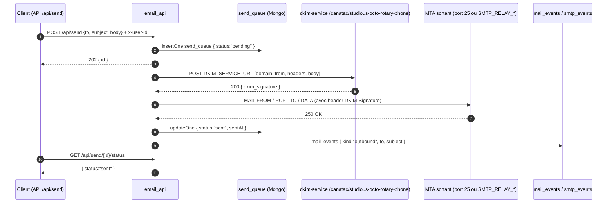
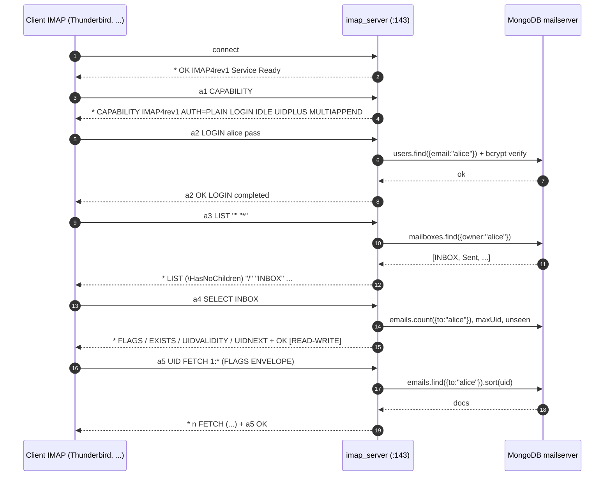
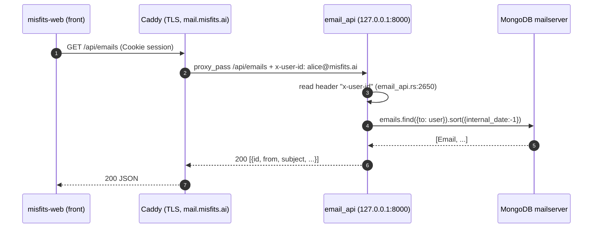
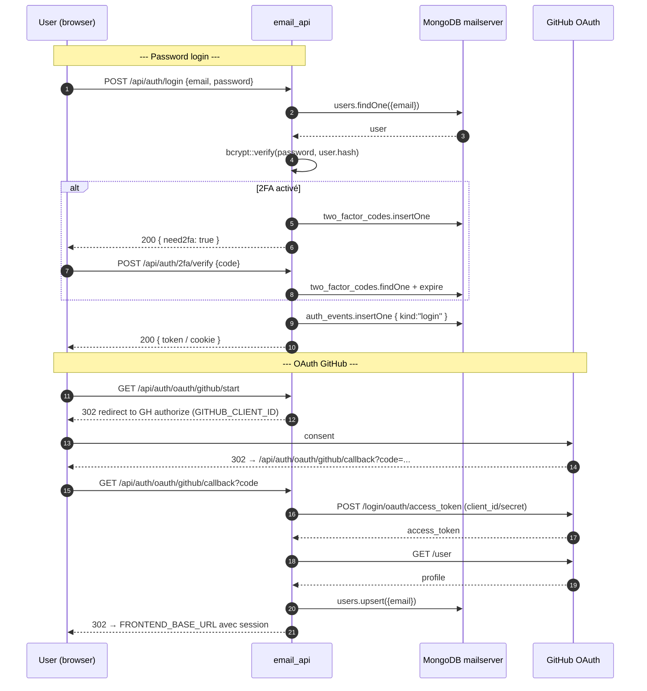

# SEQUENCE DIAGRAMS

Diagrammes tirés du code source (`src/bin/*.rs`, `src/imap_server/mod.rs`,
`src/logic/mod.rs`, `src/external_imap/mod.rs`).

## (a) Réception SMTP entrante → routing RCPT TO → MongoDB

```mermaid
sequenceDiagram
    autonumber
    participant MTA as MTA distant
    participant SMTP as smtp_server (0.0.0.0:8025/8465)
    participant SM as SessionManager (session courante)
    participant Mongo as MongoDB mailserver

    MTA->>SMTP: TCP connect
    SMTP-->>MTA: 220 mail.misfits.ai ESMTP
    MTA->>SMTP: EHLO client
    SMTP-->>MTA: 250-STARTTLS / 250 AUTH PLAIN
    MTA->>SMTP: STARTTLS
    SMTP-->>MTA: 220 Ready
    Note over SMTP,SM: Handshake TLS ; session par connexion (fix PR #243)
    MTA->>SMTP: MAIL FROM:<bob@ext.com>
    Note right of SMTP: match insensible à la casse (fix PR #243)
    SMTP-->>MTA: 250 OK
    MTA->>SMTP: RCPT TO:<alice@misfits.ai>
    SMTP-->>MTA: 250 OK
    MTA->>SMTP: DATA + corps + .
    SMTP->>SMTP: extract_email_content(body)
    SMTP->>Mongo: insertOne emails { from, to, subject, body, internal_date }
    SMTP->>Mongo: insertOne mail_events { kind:"inbound", at, from, to }
    SMTP->>Mongo: insertOne smtp_events { raw, status }
    SMTP-->>MTA: 250 OK: message queued
    MTA->>SMTP: QUIT
    SMTP-->>MTA: 221 Bye
```

## (b) Envoi SMTP sortant + service DKIM externe



## (c) IMAP fetch inbox



## (d) API GET /api/emails (inbox client authentifié)



## (e) Auth flow — login + 2FA + OAuth GitHub


